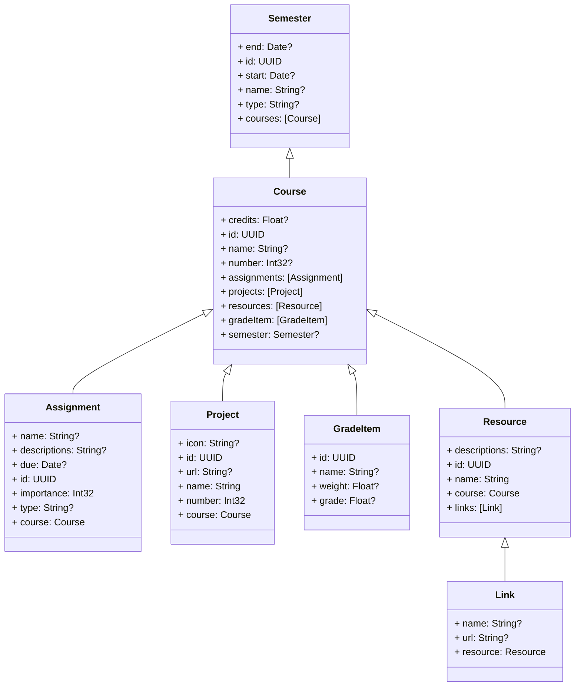
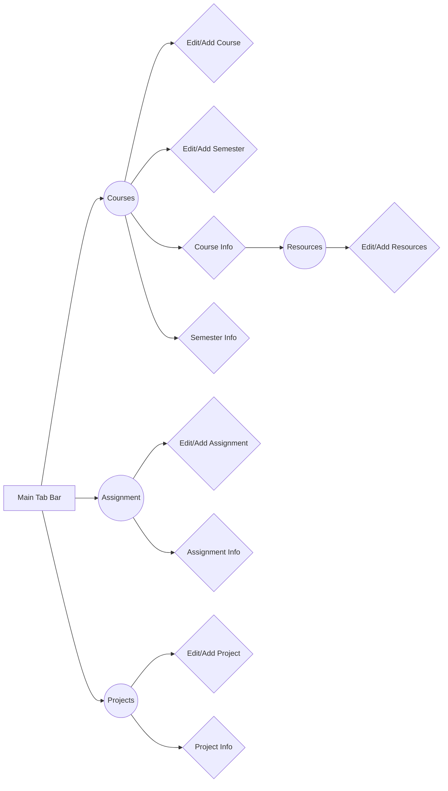

## The `UX Prototype` Project

Overview

-   "UX Prototype" is a transformative project that originated from an academic assignment in `UX/UI` design. The project was inspired by the need for an intuitive course management application, leading to its development into a real-life, fully functional app.
    

Technologies Explored

-   Leveraged the power of the `Swift` programming language, renowned for its speed, performance, and safety.
    
-   Seamlessly transitioned from using `UIKit` to `SwiftUI`, Apple's cutting-edge framework for `iOS` app development.
    
-   Followed the `Model-View-Controller` (MVC) design pattern, ensuring a modular and maintainable codebase.
    
-   Integrated `CalendarKit` for event management and Core Data for data persistence.
    

Key Features

-   Empowers students to effortlessly manage courses, semesters, assignments, and projects.
    
-   User-friendly course and semester management, allowing easy creation, editing, and deletion.
    
-   Simplifies course filtering with options for semesters and all courses.
    
-   Streamlines assignment management, categorizing tasks into "Homework," "Midterm," "Final," and "Others."
    
-   Facilitates resource management, enabling users to organize and access online materials.
    
-   `GitHub` integration in the Projects view, offering insights into the latest commits on `GitHub` repositories.

Creating the UX Prototype

I created a cutting-edge course management app designed to streamline the educational experience for students. My journey was marked by a transition from `Swift` and `UIKit` to the dynamic `SwiftUI` framework. I have embraced technology to construct a user-friendly and highly functional solution.

Project Overview

-   I embarked on a mission to develop a course management app that simplifies the academic journey.
    
-   The project, aptly named the "UX Prototype," was initially built using `Swift` and `UIKit`. Its primary goal was to streamline course management and enhance the student experience.
    

Transition to `SwiftUI`

-   As my project evolved, we recognized the potential of `SwiftUI`, Apple's innovative framework for creating user interfaces.
    
-   This led me to rebuild the entire application using `SwiftUI`, making it more efficient and responsive than ever before.

Key Features

-   The "UX Prototype" is a testament to our commitment to modern technology and innovative problem-solving.
    
-   It offers an array of features, including course and semester management, assignment tracking, and resource handling.
    
-   Integration with `Core Data` ensures persistent data storage, and `GitHub` integration allows for tracking project commits.
    

By embracing `Swift`, `UIKit`, and `SwiftUI`, I've taken a critical step in keeping up with the latest developments in `iOS` app development and creating a user-centric educational tool.

## Design Patterns

This project, the UX Prototype, is built upon a solid foundation of design patterns. Specifically, we've successfully implemented:

-   `MVC` (Model-View-Controller): The core architecture of our app follows the `MVC` design pattern. This separation of concerns into distinct components ensures that our user interface, data model, and application logic are well-organized and modular.
    
-   `MVVM` (Model-View-ViewModel): While not explicitly mentioned in the project description, we've also ventured into `MVVM` for certain views, enhancing data flow and reactivity. This approach empowers us to create more flexible and maintainable interfaces.
    

Code Organization and Scalability

Our codebase is structured with a keen focus on scalability and maintainability. We've organized it meticulously to ensure that:

-   Code remains readable and comprehensible.
    
-   Logical sections, including `Models`, `Views`, and `Controllers`, have clear and defined roles.
    
-   We've created custom views and cells that encapsulate their respective functionality, contributing to a clean, modular codebase.

## Core Data

## Data Flow (IA - Information Arcitecture)

