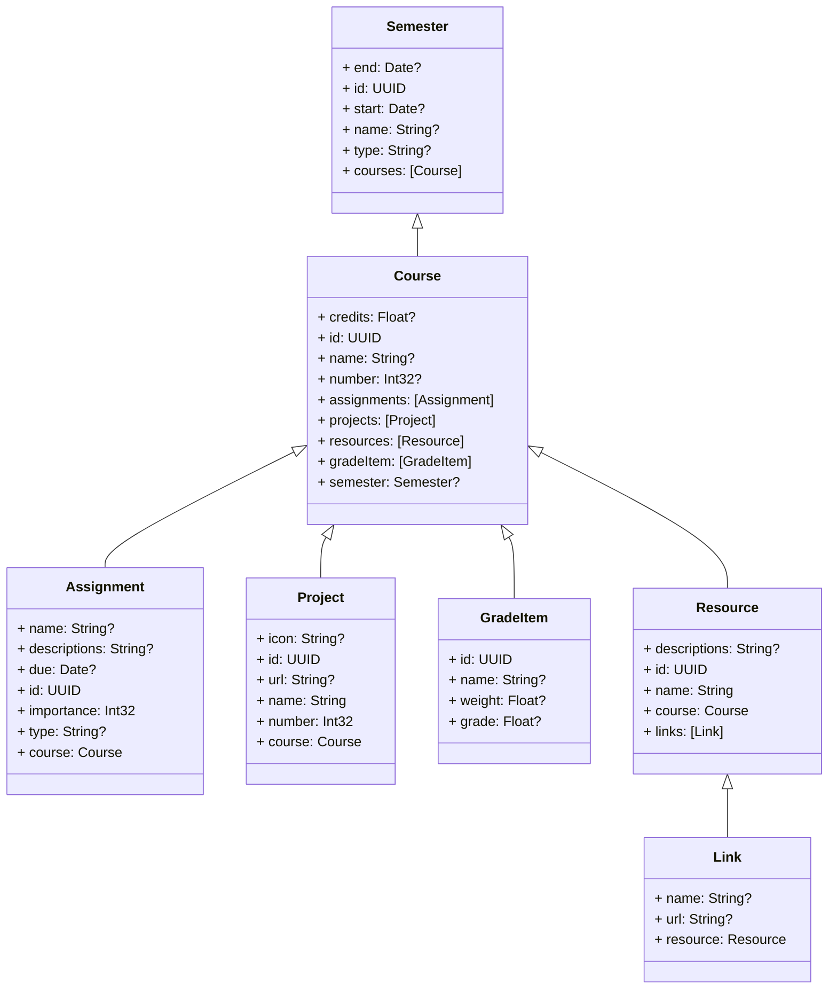
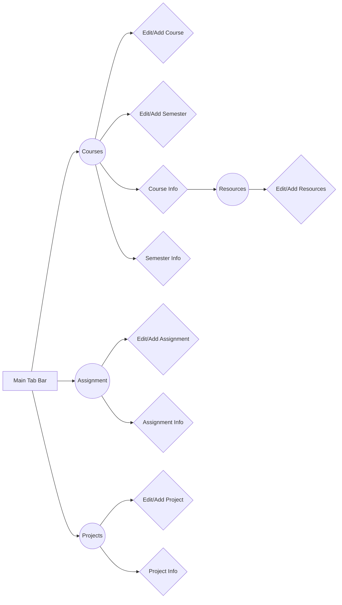

# UX-Prototype

## Overview
This project is a UX prototype for a course management application. The prototype is designed to be easy to use and navigate, and it provides a variety of features for managing courses and semesters.

This project was inspired by a course in `UX`/`UI` design, in which we had to present a prototype of an original app idea. This is the real-life project built from that prototype

## Technologies Used

* `Swift`: The prototype is written in `Swift`, which is a modern programming language developed by Apple. `Swift` is known for its speed, performance, and safety.
* `UIKit:` The app uses `UIKit`, which is Apple's framework for developing user interfaces for `iOS` applications. `UIKit` provides a variety of controls and views that can be used to create complex and interactive user interfaces.
* `SwiftUI`: The app uses `SwiftUI`, wich is Apple's framwork for develping user iterfaces for `iOS` applications.
* `Model-View-Controller (MVC)` : The prototype follows the `Model-View-Controller (MVC)` design pattern. `MVC` is a design pattern that separates the user interface, the data model, and the application logic into three separate components. This makes the code more modular and easier to maintain.
* `CalendarKit` a framwork used in the calendar tab for creating editing and deleting event.
* `CoreData` Apple's framwork to have persistante data, please see the `COREDATA.md` file to see the data structure for the project.

## Features

The course management application offers a range of features to help students manage their courses and semesters effectively:

1. **Course and Semester Management:**
   - Create new courses and semesters effortlessly by tapping the plus button in the navigation bar. Fill out the necessary details in a form and save.
   - Edit existing courses and semesters with ease. Simply swipe left and click the edit button. You can modify course or semester details and save your changes.
   - Delete unwanted courses directly from the list by swiping left.

2. **Filter Courses:**
   - Quickly find the courses you're looking for using the filter feature. Filter by semester or view all courses. Access the filter button on the left side of the navigation bar in the CourseVC view.

3. **Assignment Management:**
   - Assignments are seamlessly linked to courses and categorized as "Homework," "Midterm," "Final," or "Others."
   - Create assignments with the option to add events, which are also viewable in your iPhone calendar as well as within the app's calendar.

4. **Resource Handling:**
   - Add resources associated with your courses, including a name, description, and links to online resources. While the app doesn't handle files, it allows you to organize and access online materials.

5. **GitHub Integration:**
   - The ProjectsVC feature allows you to create and manage projects. You can specify project details like name and URL and link them to specific courses.
   - In the ProjectView, you can view the last five commits on the GitHub repository if it's public.

## Core Data

## Data Flow (IA - Information Arcitecture)

## Installation

To install the prototype, simply clone the repository and open the project in Xcode.

## Usage

To install the prototype, simply clone the repository and open the project in `Xcode`. run the application on an `iOS` device. The prototype will open to a list of all courses and semesters. You can tap on a course or semester to view its details.

To add a new course or semester, tap on the `+` button in the top right corner of the screen. To edit or delete a course or semester, swipe left on the course or semester and tap on the `Edit` or `Delete` button.

## Author

I am Daniel Attali, a third-year Software Engineering `B.Sc`. student at `JCT` (Jerusalem College of Technology). I am passionate about learning and building innovative and user-friendly software applications. I have experience in a variety of programming languages and technologies, including `Swift`, `UIKit`, and the Model-View-Controller (`MVC`) design pattern. I am also interested in `machine learning` and `artificial intelligence`.

I am a highly motivated and skilled individual with a strong work ethic. I am eager to learn and grow, and I am always looking for new challenges. I am confident that my skills and experience will make me a valuable asset to any team.

Please contact me if you have any question about the project or me.

## Screenshots

### Course/Semester + Resource

**Filtering course by semesters**

**Course Info**

**Editing course**

**Adding course**

**Swipe Action course**

**Adding Grade** 

**Editing Grade**

**Deleting Grade**

**Semester Info** 

**Editing semester**

**Adding semester**

**Resources list**

**Editing resource**

**Editing Link**

 

**Editing Link Alert**

### Assigments

**Filtering assignmetn by type**

**Assignment List**

**Adding assignment**

**Compelting assignmet**

**Uncompleting assignment**

**Swipe Action resources**

### Calendar

**creating a calendar event**

**Seeing calendar event**

**Event details in the calendar**

## Projects

**Projects list**

**Adding project**

**Editing project**

**Swipe Action project**

**Seeing last 5 commits on project**

**Commits loading**

## Conclusion

This UX prototype is a valuable tool for designing and developing a course management application. The prototype is easy to use and navigate, and it provides a variety of features for managing courses and semesters.
